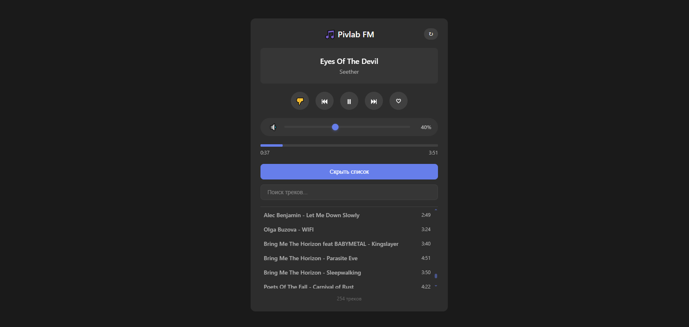

# Pivlab FM

Personal music streaming server for home network with VPN access pattern.

## Overview

Pivlab FM is a self-hosted music streaming solution designed for personal use within a secure home network environment. The application follows a client-server architecture where media content never leaves your controlled infrastructure.



## Architecture

```
[Client Device] <--VPN--> [Home Network]
                              |
                    +---------+---------+
                    |                   |
            [Nginx Reverse Proxy]  [WireGuard/OpenVPN]
                    |                   |
            [FastAPI Backend]           |
                    |                   |
            [Music Library] <-----------+
```

### Recommended Deployment Pattern

For secure remote access, Pivlab FM should be deployed behind a VPN tunnel. This ensures:
- All media traffic remains encrypted
- Authentication is handled at network level
- No exposure of streaming endpoints to public internet

## Features

- Direct audio streaming in browser
- Weighted random queue based on rating system
- Like/dislike influences playback probability
- Responsive web interface
- Real-time library search
- Docker containerization
- Designed for VPN-only access

## Music Library

### Adding Music Files
Place your audio files in the `library/` directory:
```
pivlab-fm/
└── library/          # Mount point for music files
    ├── song_name1 - artist_name1.mp3
    └── song_name2 - artist_name2.mp3
```

Supported formats: MP3, FLAC, M4A, OGG, WAV

### File Naming Convention
For better metadata recognition, name your files as:
```
Artist Name - Song Title.mp3
```
Example: `The Beatles - Hey Jude.mp3`

If no artist is detected, the system will use the filename as the track title.

### Scanning Library
After adding or removing files, trigger a library scan:
```bash
curl -X POST http://<host-ip>:80/scan
```
The scanner will:
- Add new files to the database
- Remove entries for deleted files
- Extract duration and metadata from audio files

## Rating System

The application uses a weighted random selection algorithm where each track's rating influences its playback probability.

### Rating Scale
- Range: **-10 to +10**
- Default: **0** (neutral)
- Increment: **+1** for like
- Decrement: **-1** for dislike

### Probability Calculation
The weight for each track is calculated as:
```
weight = 1 + (rating / 10)
```

This creates the following probabilities:
| Rating | Weight | Playback Chance |
|--------|--------|-----------------|
| +10 | 2.0 | 2x higher |
| 0 | 1.0 | normal |
| -5 | 0.5 | 2x lower |
| -10 | 0.1 | minimal (but not zero) |

### Track Selection Algorithm
1. Excludes the most recently played track (if multiple tracks exist)
2. Calculates weights based on current ratings
3. Performs weighted random selection
4. Updates play count and last played timestamp
5. Returns track information to client

### Statistics Tracked
- `play_count` - number of times track has been played
- `last_played` - timestamp of most recent playback
- `rating` - current user rating

## Quick Start

### Prerequisites
- Docker and Docker Compose
- VPN server (WireGuard/OpenVPN) for remote access
- Local network with static IP allocation

### Installation

1. Clone repository
```bash
git clone https://github.com/yourusername/pivlab-fm
cd pivlab-fm
```

2. Deploy with Docker
```bash
docker-compose up -d
```

3. Access application
```
http://<host-ip>:80
```

## Project Structure

```
pivlab-fm/
├── backend/
│   ├── app/               # FastAPI application
│   ├── Dockerfile
│   └── pyproject.toml     # Poetry dependencies
├── nginx/
│   ├── nginx.conf         # Reverse proxy config
│   └── src/               # Static frontend files
├── library/                # Mount point for music files
├── data/                   # SQLite database location
└── docker-compose.yml
```

## API Reference

| Endpoint | Method | Description | Auth |
|----------|--------|-------------|------|
| `/api/tracks` | GET | List all tracks | VPN |
| `/api/next` | GET | Get next weighted random track | VPN |
| `/api/tracks/{id}/like` | POST | Increment track rating | VPN |
| `/api/tracks/{id}/dislike` | POST | Decrement track rating | VPN |
| `/stream/{id}` | GET | Stream audio file | VPN |
| `/scan` | POST | Rescan music library | VPN |

## Security Considerations

This application is designed for **personal use only**. Key security practices:

1. **Never expose directly to internet** — always use VPN
2. **Regular dependency updates** — keep Docker images current
3. **Library content** — user assumes full responsibility for media rights
4. **Network isolation** — run in dedicated VLAN if possible

## License

MIT License - See [LICENSE](./LICENCE.md) file for details

---

**Disclaimer:** This software is provided for educational purposes. Users are responsible for complying with copyright laws in their jurisdiction regarding media content.
